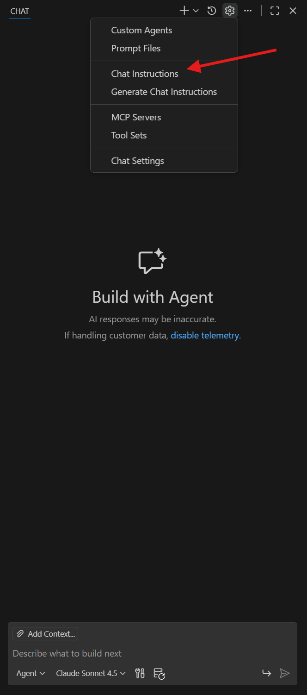
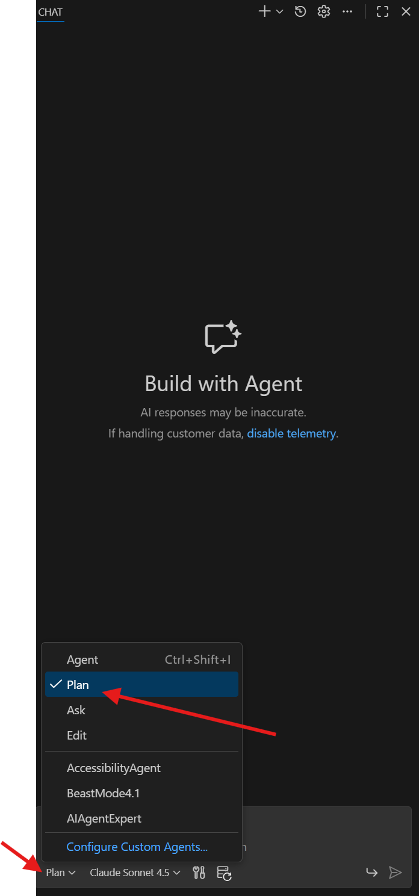

# Introduction

This repository showcases a customer case and how we leveraged GitHub Copilot end-to-end to solve their challenges. We want to showcase how GitHub Copilot can be used to accelerate development of prototypes that goes end to end. 

The customer was interested in building a PoC app with multi-agent architecture using a new agentic orchestration framework, the Agent Framework. They also wanted to explore Model Context Protocol (MCP) to connect to their API endpoint. They did not know where to start.

This showcase will guide on how to try out new libraries/frameworks while leveraging Github Copilot, to build a working proof-of-concept quickly without deep framework knowledge.

## Challenges

- Newly introduced framework: the Agent Framework
- LLM has no knowledge of this framework
- Understanding MCP integration with the framework
- Integration of multiple technologies: Agent Framework, MCP servers, external APIs, and orchestration patterns

## Solution

- Leveraging MCP Servers inside Github Copilot:
    - Microsoft Docs MCP server to provide Agent Framework documentation from Microsoft
    - Context7 MCP to leverage code examples and patterns
- Start with a clear plan/requirements using Copilot
- Create custom instructions focused on the desired idea

# Customization 

Before we start with anything, it is recommended to create custom instructions, agents or prompts that is specific to your needs.
Within GitHub Copilot and VS Code this can be done with chatmodes and custom instructions: 

- [Custom instructions](https://code.visualstudio.com/docs/copilot/customization/custom-instructions)
- [Create a custom agent](https://code.visualstudio.com/docs/copilot/customization/custom-agents#_create-a-custom-agent)

## Adding Custom MCP instruction file

Take a look at this repository, which consists a lot of various example instructions, prompts and custom agents. You can take one of them as a template and play around: [Awesome GitHub Copilot Customizations](https://github.com/github/awesome-copilot). 

We will use a custom instruction file from the [Awesome GitHub Copilot Customizations](https://github.com/github/awesome-copilot) repository. [This example instruction file](https://github.com/github/awesome-copilot/blob/main/instructions/python-mcp-server.instructions.md) focuses on building MCP servers using Python. The file contains instructions, best practices, common patterns and example code snaplets.



Now, everytime Github Copilot is editing/reading a *.py file, it will include our MCP instruction file in the context. 

## Custom Agents - Planer

We will be leverage the Plan Mode from Github Copilot as seen in the screenshot. Plan mode helps create, refine, and execute step-by-step implementation plans. Before starting to code, the plan mode analyzes your codebase, generates detailed execution plans, and validates that requirements are covered.



You can also create your own custom agent, tailored to your own requirements and ideas.

## Adding MCP servers

Right now our agent is stuck with the knowledge of the model we use. Furthermore there are no additional function calling capabilities (eg. interacting with Azure CLI or external tools).

For this reason we will add MCP servers to our custom agent that can help us with additional knowledge and function calling capabilities. We can either leverage the internal marketplace of VS Code (https://code.visualstudio.com/docs/copilot/customization/mcp-servers) or use the GitHub MCP Registry with one click integration: https://github.com/mcp

We recommend going for the following MCP servers:

- **Context 7**: Context7 MCP pulls up-to-date, version-specific documentation and code examples straight from the source — and places them directly into your prompt: https://github.com/mcp/io.github.upstash/context7

- **Microsoft Learn MCP**: Provides access to Microsoft Learn documentation and tutorials for additional guidance, necessary working with a library from Microsoft like Agent Framework: https://github.com/mcp/microsoftdocs/mcp

After you have added the MCP servers to VS Code you can enable them selecting `Configure Tools` and ticking the boxes, as seen in this example: 

[Configure Tools](assets/configure_tools.png)

# Implementation

With the custom instruction and MCP servers in place we can now start the implementation of our prototype.

We will first leverage the planner agent to help us with the implementation. Start a new chat with the planner agent and provide the following input to it. **Be sure to have selected your custom agent from the dropdown in the chat window.**

```markdown

I need to build a multi-agent PoC using Microsoft's Agent Framework in Python. The requirements are:

**Architecture:**
- Two agents that communicate to complete a collaborative task
- Agent 1, the Poet: Accesses a custom MCP server to retrieve Lord of the Rings quotes from an API (https://the-one-api.dev/v2/quote), then writes a brief LOTR-themed poem
- Agent 2, the Critic: Reviews the poem for content accuracy, length, and LOTR lore compliance

**MCP Server Requirements:**
- Implement a custom MCP server that connects to The One API
- Handle Bearer token authentication: `Authorization: Bearer your-api-key-123`
- Expose tools for quote retrieval

**Workflow:**
- Agents should iterate in a "ping-pong" pattern with visible interaction logging
- Implement a configurable limit on iteration rounds (e.g., max 5 exchanges)
- User should see the full conversation flow

Please create a detailed implementation plan. I have access to #Microsoft Docs and #upstash/context7 MCP servers for up-to-date Agent Framework documentation and examples.

```

The planning should take a moment. After the plan is ready, let's start with the implementation. Let's either change to `Agent` Mode or your custom implementer agent and provide the following input reference the MCP servers we have:

```markdown

Looking at the previous plan, please start implementing this project considering your #Microsoft Docs and #upstash/context7 tools.

```

Check the chat window to see what has been built.

[Impementation Window](assets/implementation_window.png)

Github Copilot should be done with the implementation. You should start the prototype to verify that everything is working as expected. If you have problems to start the prototype then ask the agent for help to troubleshoot the issues!

Let's be realistic: There might be errors during deployment. If that is the case leverage the agent to help you troubleshoot the issues. We suggest to nudge the agent with the error messages you get during deployment to get help on how to fix them.